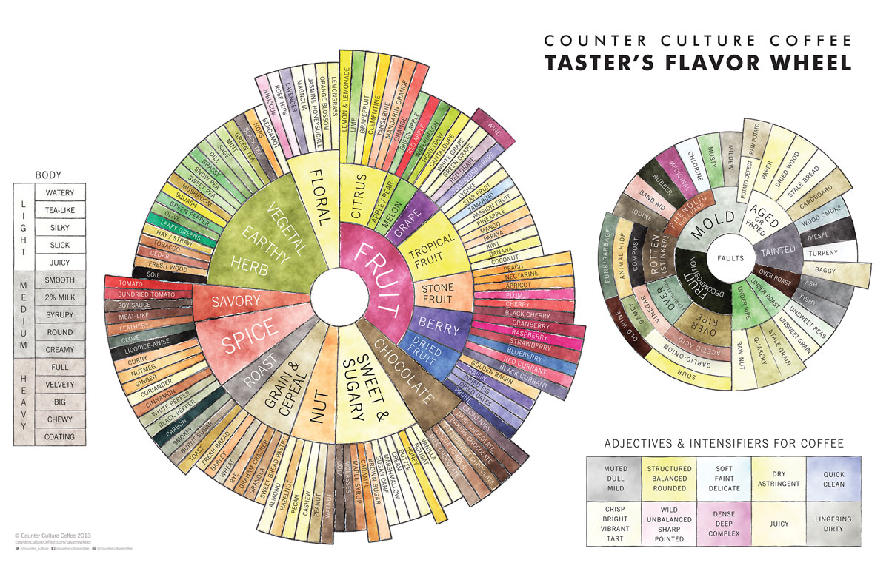

# Flavors and Descriptors

==========================

## Source

The descriptors available for beans and brew types are derived from the near-canon Counter Culture Flavor Wheel, shown below.

If the image doesn't display, you can find it [here](https://counterculturecoffee.com/learn/resource-center/coffee-tasters-flavor-wheel).

## Assumptions
The enumerations made from this flavor wheel are working off the reasonable assumption that no one would like a moldy or highly acidic brew of coffee, so these are lumped under the NegativeTraits enum type.
